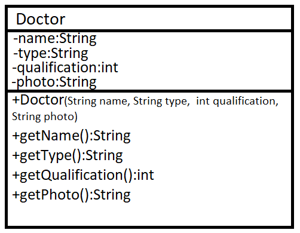
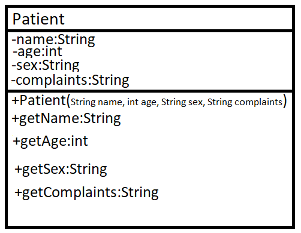
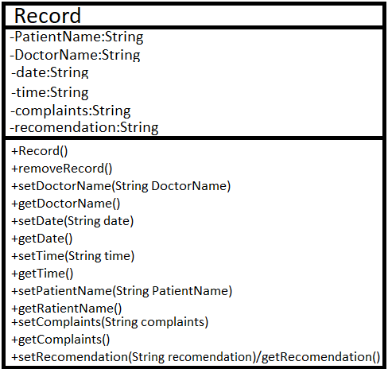

# Тема: Медицина

Темой своего проекта я выбрала тему №3, которая реализует приложение для врачей и пациентов медицинского учреждения. 

В моем приложении я хочу реализовать ряд возможностей, как для врачей, так и для пациентов. 

1. У каждого врача будет своя учетная запись, в которой будут отображаться записи на приём на текущий день. В профиле врача будет содержаться следующие данные: ФИО, профиль, квалификация, фото.

2. У каждого пациента также будет учетная запись, в которой будут отображаться следующие данные: ФИО, возраст, пол, жалобы.

3. Также я хочу реализовать класс Запись, в котором будет храниться информация о записи на приём: ФИО пациента, ФИО врача, дата приема, время приема, жалобы пациента, рекомендации врача. Методы у класса будут следующие: конструктор (создает новую запись), метод удаления записи, метод, получающий имя пациента, метод, получающий имя врача, метод, получающий дату приема, метод, получающий время приема, метод получающий жалобы пациента, метод, получающий рекомендации врача, соответствующие методы, возвращающие данные поля и, возможно, некоторые другие методы.

4. Открыв приложение, перед пользователем будет стоять выбор (две конпки): врач или пациент. Вход в учетную запись врача происходит по имени и профилю. В учетной записи врача хранятся данные о записях на текущий день. Запись можно будет подтвердить или отменить, добавить рекомендации по лечению. Выбрав кнопку пациент, перед пользователем появится выпадающий список с выбором профиля врача, далее список врачей и их квалификация с фото, далее выбор даты и времени, ввод ФИО и жалоб, подтверждение записи. В профиле пациента будут перечислены все записи на приём.

Некоторые поля и методы классов могут быть изменены в ходе выполнения работы.